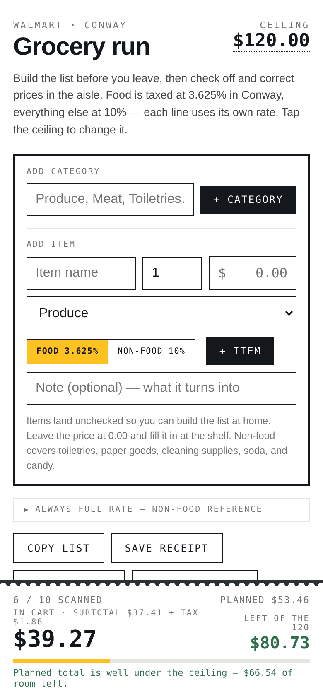
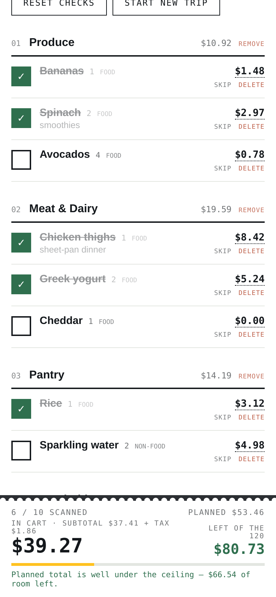

# Grocery Run

**Live app:** https://kjgthecoder.github.io/grocery-run/ — open it on your phone and add it to your home screen.

I don't like grocery shopping through a screen — I'd rather walk the aisles myself. What I
*didn't* like was getting to the register and being surprised by the total. Grocery Run is the
middle ground: I build the list at home, then check items off and correct prices in the aisle,
and a running receipt at the bottom of the screen shows exactly what the checkout total will
be — tax included — before I get there.

<p>
  
  
</p>

*Screenshots use demo data.*

## What it does

- **Running receipt tape** pinned to the bottom: items in the cart, subtotal, tax, the real
  total, and how much is left under your budget ceiling.
- **Per-line tax, not a blended rate.** Arkansas taxes grocery food at a reduced rate and
  everything else at the full rate, so each item carries its own rate (3.625% food / 10%
  non-food in Conway). A built-in reference covers the non-obvious cases — soda, candy,
  prepared food, and supplements are always full rate.
- **Plan at home, correct in the aisle.** Items start unchecked with an optional price; fill in
  the shelf price as you go. Items can be skipped, and tagged as core, add-on, or
  "trim first" when the total runs high.
- **Works with no signal.** The whole app is precached by a service worker, so it opens in the
  back of the store where there's no reception.
- **Copy the list or save the receipt** as plain text.

## How it's built

A single HTML file of vanilla JavaScript and CSS — no framework, no build step, no
dependencies — plus a service worker and a web app manifest so it installs like a native app.

```
index.html      the app (HTML + CSS + vanilla JS)
manifest.json   PWA manifest
sw.js           service worker (precached shell, cache-first)
icons/          192 / 512 / maskable-512 / apple-touch-180 PNGs
serve.py        tiny static server for local use (stdlib only)
```

### Data and storage

- The whole trip is one state object saved to `localStorage` (`groceryRun.v1`) on every render.
- On load it's merged field by field onto the defaults, so a trip saved by an older version
  keeps working, and corrupt data falls back to defaults instead of a blank page.
- **Reset checks** unchecks everything but keeps items and prices; **Start new trip** clears
  the list but keeps the ceiling. There's deliberately one list at a time.

### Offline and updates

The shell is precached on install and served cache-first. To ship an update, bump `VERSION` in
`sw.js` — `activate` deletes every other cache. Forget to bump it and the old version keeps
being served.

## Run it locally

```sh
python3 serve.py        # http://localhost:8000
```

`serve.py` is `http.server` with the fixes a PWA needs: `/` serves `index.html` so the
manifest's `start_url` works, explicit MIME types for the manifest and service worker, and
`no-store` on the HTML and `sw.js` so the browser cache can't hide an update.

Service workers only register on HTTPS or `localhost` — serving over a LAN IP
(`http://192.168.x.x`) loads the page but silently skips the service worker, so there's no
offline cache and no install prompt.

## License

MIT
